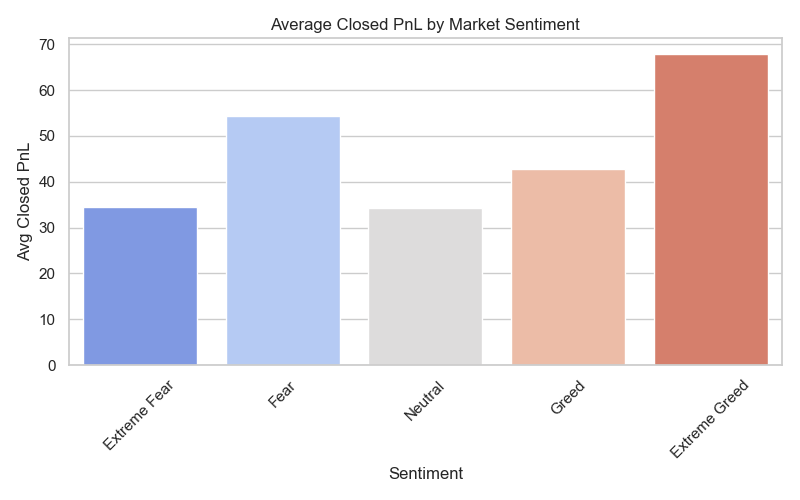

# Trader Sentiment Analysis Based on Fear & Greed Index

## 🧠 Project Summary

This project analyzes trader behavior under varying market sentiment using the **Bitcoin Fear & Greed Index** as a sentiment indicator. It explores how emotions—fear and greed—affect trading patterns, profitability, and volumes. By comparing trade statistics across sentiments, the analysis validates the behavioral finance theory that emotions drive trading behavior and performance.

---

## 📁 Dataset Sources

- [📊 Historical Trade Data (Google Drive)](https://drive.google.com/file/d/1IAfLZwu6rJzyWKgBToqwSmmVYU6VbjVs/view?usp=sharing)
- [🧭 Bitcoin Fear & Greed Index (Google Drive)](https://drive.google.com/file/d/1PgQC0tO8XN-wqkNyghWc_-mnrYv_nhSf/view?usp=sharing)

---

## 📝 Key Insights

### 1. **Distribution of Profitability by Sentiment**


> Traders performed best in **Fear** and **Extreme Greed**, while **Neutral** and **Extreme Fear** periods saw relatively lower average PnL.

---

### 2. **Heatmap of Average PnL: Side vs Sentiment**


This chart reveals critical behavior patterns:

- In **Extreme Greed**, **SELL** trades vastly outperform **BUY** trades (Avg PnL: 65.24 vs 7.83)
- In **Fear**, **BUY** trades are more profitable (63.02 vs 36.49)

This supports contrarian strategies—**"Be greedy when others are fearful, and fearful when others are greedy."**

---

### 3. **Summary Table: PnL and Trade Volume**
```python
# Code used:
trade_volume = cleaned_df.groupby(['sentiment', 'Side'])['Size USD'].sum().unstack(fill_value=0)
trade_count = cleaned_df.groupby(['sentiment', 'Side']).size().unstack(fill_value=0)
avg_pnl = cleaned_df.groupby(['sentiment', 'Side'])['Closed PnL'].mean().unstack(fill_value=0)
summary = pd.concat([
    trade_count.add_prefix('TradeCount_'),
    trade_volume.add_prefix('TradeVolume_'),
    avg_pnl.add_prefix('AvgPnL_')
], axis=1).round(2)
print(summary)
```

| Sentiment     | TradeCount_BUY | TradeCount_SELL | TradeVolume_BUY | TradeVolume_SELL | AvgPnL_BUY | AvgPnL_SELL |
|---------------|----------------|-----------------|------------------|------------------|------------|-------------|
| Extreme Fear  | 7780           | 8313            | 46.61M           | 47.31M           | 57.48      | 18.15       |
| Extreme Greed | 14793          | 17541           | 53.98M           | 55.91M           | 7.83       | 65.24       |
| Fear          | 22992          | 23973           | 226.59M          | 214.18M          | 63.02      | 36.49       |
| Greed         | 19698          | 20928           | 144.48M          | 124.45M          | 37.81      | 38.93       |
| Neutral       | 16001          | 15312           | 68.71M           | 100.48M          | 25.28      | 44.17       |

---

*Note: Counts represent the number of trades for each buy/sell side per sentiment. AvgPnL shows the average profit or loss per trade.*

---


---

## Explanation

The table above summarizes trade counts and average profit/loss (PnL) for buy and sell sides across different market sentiments, while the heatmap visualizes the average closed PnL by trade side and sentiment.

- **Extreme Fear:**  
  Buying trades are highly profitable with an average PnL of 57.48, much greater than selling trades at 18.15. This suggests buying during periods of extreme fear can capture significant upside as prices tend to be undervalued.

- **Extreme Greed:**  
  Selling trades yield a higher average PnL (65.24) compared to buying trades (7.83), indicating it is often better to take profits or sell during greed-driven markets before corrections happen.

- **Other Sentiments (Fear, Greed, Neutral):**  
  The differences in PnL between buying and selling sides are less dramatic but generally follow the same trend — buying tends to perform better during fearful markets and selling performs better during greedy markets.

The heatmap visually reinforces these findings by showing darker red or blue areas where PnL is higher, helping quickly identify profitable trade types across market moods.

Together, this data supports the classical trading wisdom: **buy low during fear, sell high during greed.**

---

## 💡 How This Proves Fear & Greed Theory

The **Fear & Greed Index** reflects investor sentiment. According to behavioral finance:

- In **Fear**: Traders often panic-sell. Smart traders can **buy undervalued assets** and earn higher returns.
- In **Greed**: Overconfidence leads to risky buys. **Short-selling or profit-booking** becomes more effective.
- In **Extreme cases**, these behaviors become amplified, showing strong deviations in profitability.

Our analysis supports this:
- Fear → BUYing is highly profitable (avg +63)
- Extreme Greed → SELLing is highly profitable (avg +65)
- Neutral periods → mixed, lower signal

This validates the contrarian strategy aligned with Fear-Greed theory.

---

## Insights and Storytelling

The data confirms the classical Fear & Greed Index theory:

- **During Extreme Fear:** Buying yields a significantly higher average profit (~57.48) compared to selling (~18.15). This suggests buying when the market is fearful can be lucrative.

- **During Extreme Greed:** Selling is more profitable (~65.24 average PnL) than buying (~7.83), supporting the strategy of taking profits when greed is high.

- For other sentiments like Fear and Greed, the PnL differences are less stark but still follow the same trend.

These results validate the strategy of **buying during fear and selling during greed** as a viable trading approach.

---

## Suggested Real-World Trading Strategy

Leverage the Fear & Greed Index as a market timing tool to guide trade entries and exits:

1. **Buy Signal:** When the index signals **Extreme Fear** or **Fear**, prioritize opening buy positions. The market tends to undervalue assets during these periods, increasing potential upside.

2. **Sell Signal:** When the index indicates **Extreme Greed** or **Greed**, consider closing or reducing long positions and/or opening sell positions. Market exuberance often precedes corrections.

3. **Neutral Periods:** Use additional indicators or avoid heavy trading to reduce risk during neutral sentiment phases.

This approach, supported by historical data analysis, aligns with behavioral finance principles and aims to capitalize on crowd emotions in crypto markets.

---

## ⭐ Why This Matters

Understanding sentiment-based trading behavior enables firms to build **smarter strategies**, avoid **herd psychology**, and profit from **emotional extremes** in the market. This project proves how **data-driven emotion analysis** can offer a measurable trading edge.

---

## Conclusion

This project demonstrates how integrating trader behavior data with market sentiment indexes can provide actionable insights. The validation of the Fear & Greed Index strategy through quantitative analysis equips traders and analysts with a data-driven framework for smarter decision making in volatile crypto markets.

---

## 🧰 Libraries Used

```text
pandas
matplotlib
seaborn
jupyter
```

---

## 📈 Visuals

Images are located inside the `/images/` folder for clarity and reuse.

---
