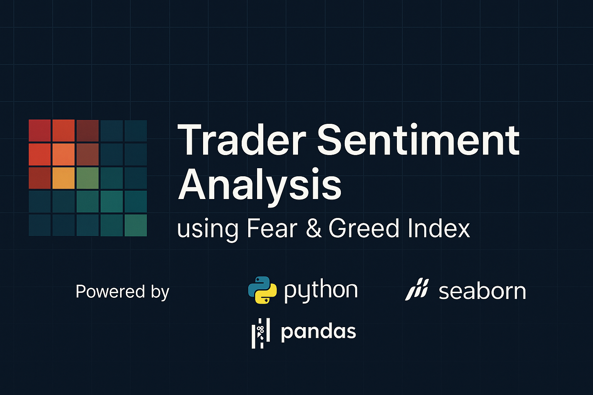
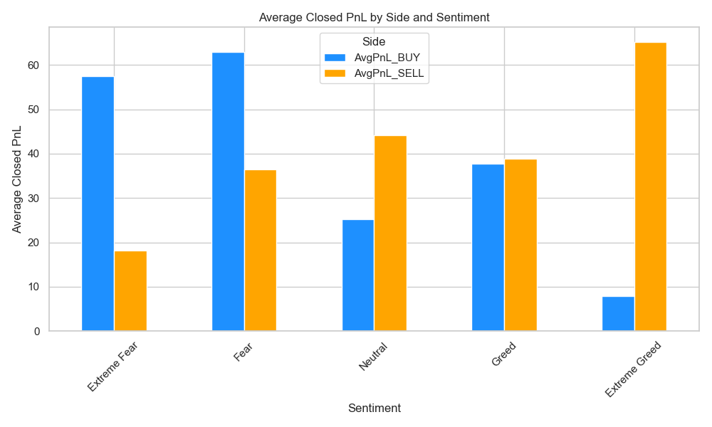
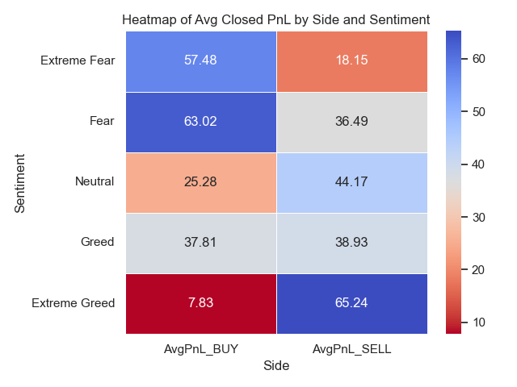

#  Trader Sentiment Analysis Based on Fear & Greed Index



---

## Project Summary

This project analyzes trader behavior under varying market sentiment using the **Bitcoin Fear & Greed Index**. It explores how emotions—fear and greed—affect trading patterns, profitability, and volume.

By comparing trade statistics across sentiment levels, the analysis validates behavioral finance theory: **emotions drive trading performance**.

---

## Dataset Sources

- [📊 Historical Trade Data (Google Drive)](https://drive.google.com/file/d/1IAfLZwu6rJzyWKgBToqwSmmVYU6VbjVs/view?usp=sharing)  
- [🧭 Bitcoin Fear & Greed Index (Google Drive)](https://drive.google.com/file/d/1PgQC0tO8XN-wqkNyghWc_-mnrYv_nhSf/view?usp=sharing)

---

## Objective

This project explores the relationship between trader performance and Bitcoin market sentiment using two datasets:

- **Bitcoin Sentiment Data** – Daily Fear & Greed classifications  
- **Hyperliquid Trade Data** – Detailed trades including side, size, closed PnL, leverage, etc.

The goal is to discover patterns that support smarter, emotion-aware trading strategies in volatile crypto markets.

---

## Methodology

1. **Data Cleaning** – Removed nulls, aligned timestamps, standardized sentiment and side labels  
2. **Integration** – Merged sentiment and trade data by date  
3. **EDA** – Explored how trade counts, PnL, and volumes vary by sentiment  
4. **Visualization** – Created heatmaps and plots for clarity  
5. **Insight Derivation** – Quantified how fear and greed impact PnL  
6. **Strategy Framing** – Suggested a sentiment-based real-world trading strategy

---

## Key Insights

### Summary Table: PnL and Trade Volume

```python
trade_volume = cleaned_df.groupby(['sentiment', 'Side'])['Size USD'].sum().unstack(fill_value=0)
trade_count = cleaned_df.groupby(['sentiment', 'Side']).size().unstack(fill_value=0)
avg_pnl = cleaned_df.groupby(['sentiment', 'Side'])['Closed PnL'].mean().unstack(fill_value=0)

summary = pd.concat([
    trade_count.add_prefix('TradeCount_'),
    trade_volume.add_prefix('TradeVolume_'),
    avg_pnl.add_prefix('AvgPnL_')
], axis=1).round(2)
print(summary)
```

| Sentiment     | TradeCount_BUY | TradeCount_SELL | TradeVolume_BUY | TradeVolume_SELL | AvgPnL_BUY | AvgPnL_SELL |
|---------------|----------------|-----------------|------------------|------------------|------------|-------------|
| Extreme Fear  | 7780           | 8313            | 46.61M           | 47.31M           | 57.48      | 18.15       |
| Extreme Greed | 14793          | 17541           | 53.98M           | 55.91M           | 7.83       | 65.24       |
| Fear          | 22992          | 23973           | 226.59M          | 214.18M          | 63.02      | 36.49       |
| Greed         | 19698          | 20928           | 144.48M          | 124.45M          | 37.81      | 38.93       |
| Neutral       | 16001          | 15312           | 68.71M           | 100.48M          | 25.28      | 44.17       |

---



---

### Heatmap: Avg PnL vs Side and Sentiment



**Insights:**

- 📉 **Extreme Greed**: SELL trades vastly outperform BUY trades (65.24 vs 7.83)
- 📈 **Fear**: BUY trades are more profitable (63.02 vs 36.49)

These results validate the classic contrarian strategy:

> _“Be greedy when others are fearful, and fearful when others are greedy.”_

---

## Explanation

- **Extreme Fear**: Buying is very profitable → undervalued assets  
- **Extreme Greed**: Selling is highly profitable → profit-booking before corrections  
- **Neutral**: Mixed signals, lower performance

The data supports using emotion as a trade filter.

---

## Strategy Suggestion

 **Buy During Fear**  
 **Sell During Greed**  
 **Avoid Neutral Periods**

Sentiment-driven signals can serve as **entry/exit triggers** to reduce emotional bias and optimize profits.

---

## Why This Matters

- Applies **behavioral finance** to real trading data  
- Quantifies **emotional alpha**  
- Builds a data-driven case for **contrarian investing**

---

## Conclusion

By blending market psychology with historical trader data, this project proves that **sentiment-aware strategies** can deliver measurable trading advantages.

---

## Tech Stack

```text
Python  
Pandas 
Seaborn   
Matplotlib 
Jupyter 
```

>  Powered by Python + Pandas + Seaborn  
>  Visuals built for clarity and data storytelling  

---

##  Visuals

All images are stored inside the `/images/` folder.

---

##  Repo Maintaintained by

**Vishnujan Narayanan**  
[LinkedIn](www.linkedin.com/in/vishnujan-narayanan) 

---
