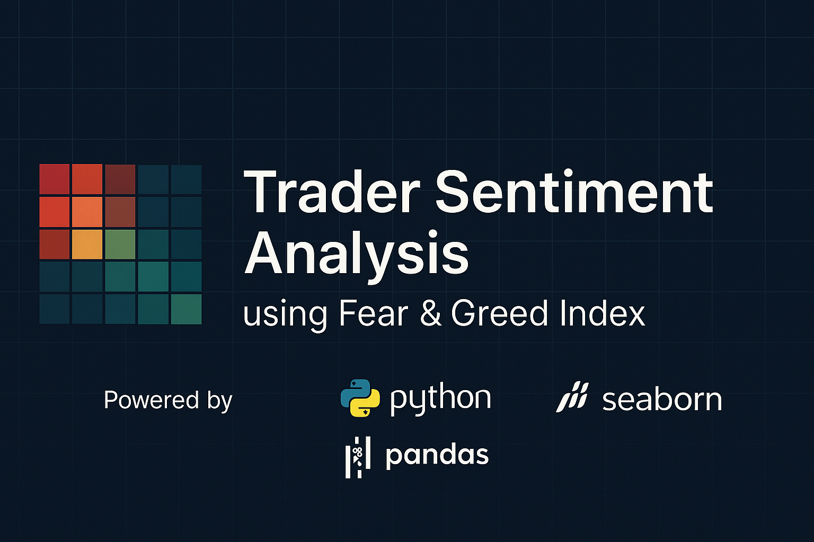
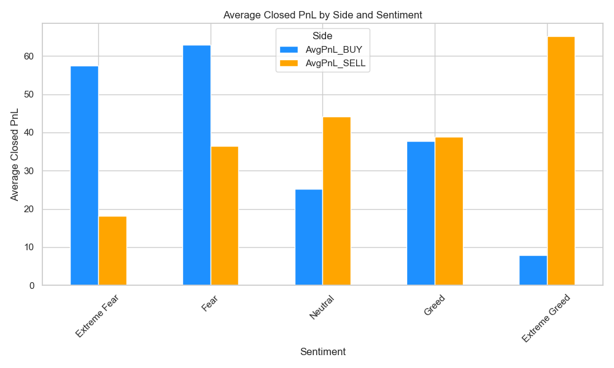
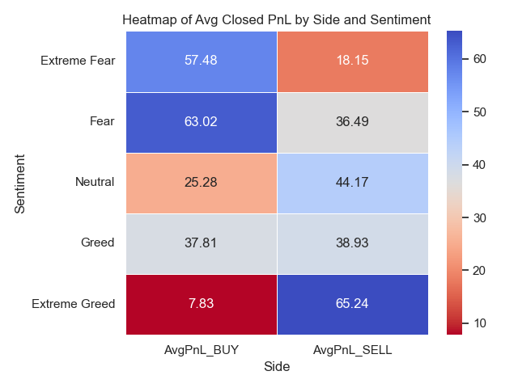
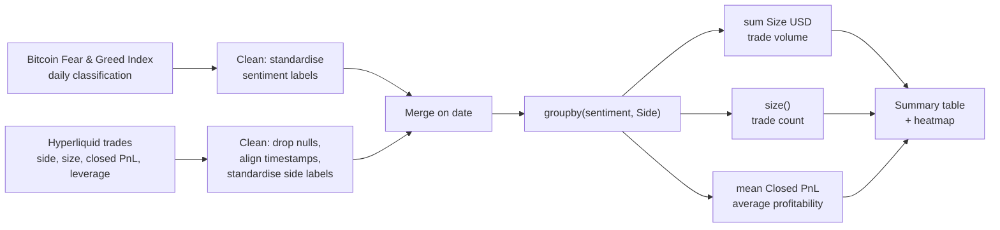

<h1 align="center">Trader Sentiment Analysis</h1>

<p align="center">
  Do traders actually make money being contrarian? Measuring realised PnL across<br>
  167,331 Hyperliquid trades, segmented by the Bitcoin Fear &amp; Greed Index.
</p>

<p align="center">
  
  
  
  
  
  
  
  <br>
  <a href="https://vishnujan-narayanan.vercel.app/"></a>
  <a href="https://github.com/VishnujanNarayanan"></a>
  <a href="https://www.linkedin.com/in/vishnujan-narayanan"></a>
  <a href="https://substack.com/@vishnujannarayanan"></a>
</p>

<p align="center">
  🎯 <a href="#why-this-project-exists">Why</a> ·
  🧩 <a href="#architecture">Architecture</a> ·
  📊 <a href="#key-insights">Results</a> ·
  ⚡ <a href="#installation">Installation</a> ·
  🖼️ <a href="#visuals">Figures</a> ·
  ⚠️ <a href="#limitations">Limitations</a>
</p>



---

## Why this project exists

"Be greedy when others are fearful" is repeated constantly and tested rarely. It is a claim about
returns, and returns are measurable — if you can line up a sentiment reading against the realised
PnL of actual trades on the days that reading applied.

This project does exactly that join. Daily Bitcoin Fear &amp; Greed classifications are merged
against Hyperliquid trade records on date, then average closed PnL is computed per
(sentiment, side) cell. The result is a direct answer to a specific question: on days the market
was fearful, did buyers or sellers earn more?

---

## Project Summary

This project analyzes trader behavior under varying market sentiment using the **Bitcoin Fear & Greed Index**. It explores how emotions—fear and greed—affect trading patterns, profitability, and volume.

By comparing trade statistics across sentiment levels, the analysis validates behavioral finance theory: **emotions drive trading performance**.

---

## Dataset Sources

- [📊 Historical Trade Data (Google Drive)](https://drive.google.com/file/d/1IAfLZwu6rJzyWKgBToqwSmmVYU6VbjVs/view?usp=sharing)  
- [🧭 Bitcoin Fear & Greed Index (Google Drive)](https://drive.google.com/file/d/1PgQC0tO8XN-wqkNyghWc_-mnrYv_nhSf/view?usp=sharing)

---

## Objective

This project explores the relationship between trader performance and Bitcoin market sentiment using two datasets:

- **Bitcoin Sentiment Data** – Daily Fear & Greed classifications  
- **Hyperliquid Trade Data** – Detailed trades including side, size, closed PnL, leverage, etc.

The goal is to discover patterns that support smarter, emotion-aware trading strategies in volatile crypto markets.

---

## Methodology

1. **Data Cleaning** – Removed nulls, aligned timestamps, standardized sentiment and side labels  
2. **Integration** – Merged sentiment and trade data by date  
3. **EDA** – Explored how trade counts, PnL, and volumes vary by sentiment  
4. **Visualization** – Created heatmaps and plots for clarity  
5. **Insight Derivation** – Quantified how fear and greed impact PnL  
6. **Strategy Framing** – Suggested a sentiment-based real-world trading strategy

---

## Key Insights

### Summary Table: PnL and Trade Volume

```python
trade_volume = cleaned_df.groupby(['sentiment', 'Side'])['Size USD'].sum().unstack(fill_value=0)
trade_count = cleaned_df.groupby(['sentiment', 'Side']).size().unstack(fill_value=0)
avg_pnl = cleaned_df.groupby(['sentiment', 'Side'])['Closed PnL'].mean().unstack(fill_value=0)

summary = pd.concat([
    trade_count.add_prefix('TradeCount_'),
    trade_volume.add_prefix('TradeVolume_'),
    avg_pnl.add_prefix('AvgPnL_')
], axis=1).round(2)
print(summary)
```

| Sentiment     | TradeCount_BUY | TradeCount_SELL | TradeVolume_BUY | TradeVolume_SELL | AvgPnL_BUY | AvgPnL_SELL |
|---------------|----------------|-----------------|------------------|------------------|------------|-------------|
| Extreme Fear  | 7780           | 8313            | 46.61M           | 47.31M           | 57.48      | 18.15       |
| Extreme Greed | 14793          | 17541           | 53.98M           | 55.91M           | 7.83       | 65.24       |
| Fear          | 22992          | 23973           | 226.59M          | 214.18M          | 63.02      | 36.49       |
| Greed         | 19698          | 20928           | 144.48M          | 124.45M          | 37.81      | 38.93       |
| Neutral       | 16001          | 15312           | 68.71M           | 100.48M          | 25.28      | 44.17       |

---



---

### Heatmap: Avg PnL vs Side and Sentiment



**Insights:**

- 📉 **Extreme Greed**: SELL trades vastly outperform BUY trades (65.24 vs 7.83)
- 📈 **Fear**: BUY trades are more profitable (63.02 vs 36.49)

These results validate the classic contrarian strategy:

> _“Be greedy when others are fearful, and fearful when others are greedy.”_

---

## Explanation

- **Extreme Fear**: Buying is very profitable → undervalued assets  
- **Extreme Greed**: Selling is highly profitable → profit-booking before corrections  
- **Neutral**: Mixed signals, lower performance

The data supports using emotion as a trade filter.

---

## Strategy Suggestion

 **Buy During Fear**  
 **Sell During Greed**  
 **Avoid Neutral Periods**

Sentiment-driven signals can serve as **entry/exit triggers** to reduce emotional bias and optimize profits.

---

## Why This Matters

- Applies **behavioral finance** to real trading data  
- Quantifies **emotional alpha**  
- Builds a data-driven case for **contrarian investing**

---

## Conclusion

By blending market psychology with historical trader data, this project proves that **sentiment-aware strategies** can deliver measurable trading advantages.

---

## Architecture


```mermaid
flowchart LR
    S["Bitcoin Fear &amp; Greed Index<br/>daily classification"] --> C1["Clean: standardise<br/>sentiment labels"]
    T["Hyperliquid trades<br/>side, size, closed PnL, leverage"] --> C2["Clean: drop nulls,<br/>align timestamps,<br/>standardise side labels"]

    C1 --> M["Merge on date"]
    C2 --> M

    M --> G["groupby(sentiment, Side)"]
    G --> A1["sum Size USD<br/>trade volume"]
    G --> A2["size()<br/>trade count"]
    G --> A3["mean Closed PnL<br/>average profitability"]

    A1 & A2 & A3 --> R["Summary table<br/>+ heatmap"]
```

The join is on **date**, so a trade inherits the sentiment classification of the day it was
placed. That is the assumption the whole analysis rests on — see [Limitations](#limitations).

---

## Project Structure

```
Trader_sentiment_analysis/
├── traders_sentiment.ipynb     # The analysis: cleaning, merge, aggregation, figures
├── images/                     # Generated figures + banner
│   ├── banner.png
│   ├── heatmap.png
│   ├── pnl_vs_sentiment.png
│   ├── pnl_vs_side_sentiment.png
│   └── Trader_sentiment_analysis2.png / 3.png
├── requirements.txt
└── README.md
```

---

## Installation

```bash
git clone https://github.com/VishnujanNarayanan/Trader_sentiment_analysis.git
cd Trader_sentiment_analysis

python -m venv env
source env/bin/activate      # Linux / macOS
env\Scripts\activate         # Windows

pip install -r requirements.txt
```

Download both datasets from the [links above](#dataset-sources) and place them beside the
notebook, then:

```bash
jupyter notebook traders_sentiment.ipynb
```

---

## Dependencies

| Package | Why |
|---|---|
| `pandas` | Cleaning, the date merge, and every groupby aggregation |
| `seaborn` | The sentiment × side heatmap |
| `matplotlib` | Bar charts and figure export |
| `notebook` | Running the analysis |

---

## Visuals

All figures are generated by the notebook and written to `images/`.

| Figure | Shows |
|---|---|
| `pnl_vs_side_sentiment.png` | Average PnL by side within each sentiment band |
| `heatmap.png` | Average PnL across the full sentiment × side grid |
| `pnl_vs_sentiment.png` | Average PnL by sentiment, sides combined |

---

## Limitations

- **The effect is measured, not explained.** Higher average PnL for buyers during fear is a
  correlation. Nothing here establishes that sentiment *caused* it.
- **Sentiment is joined at daily resolution.** A trade placed during a mid-day reversal is
  labelled with the whole day's classification.
- **Averages hide the distribution.** `mean(Closed PnL)` is reported without medians, variance, or
  confidence intervals, so a handful of large wins can move a cell substantially.
- **No statistical significance testing.** The differences between cells are not tested, so it is
  unknown which of them would survive a hypothesis test.
- **Position size is not controlled for.** Trade volume varies more than 4× across sentiment
  bands, and per-trade average PnL does not adjust for that.
- **Survivorship and selection are unaddressed.** These are the traders who were active on
  Hyperliquid in this window, which is not a random sample of traders.
- **Costs are excluded.** Fees, funding, and slippage are not netted out of closed PnL.
- **One venue, one asset class.** Hyperliquid perpetuals only; the result may not generalise.
- **No out-of-sample check.** The strategy suggestion is derived from the same data used to
  measure the effect, so it is a description of the past rather than a validated rule.
- **The datasets are hosted on Google Drive**, not committed, so reproducibility depends on
  those links staying live.

---

## Roadmap

- Report medians and confidence intervals alongside the means.
- Test the fear-buy / greed-sell differences for significance.
- Weight PnL by position size, and report PnL as a percentage of notional.
- Net out fees and funding.
- Split the window into train and holdout periods to check the effect out of sample.
- Compare against a buy-and-hold benchmark over the same period.

---

## Tech Stack

```text
Python · Pandas · Seaborn · Matplotlib · Jupyter
```

---

## License

Released under the MIT License — free to use, modify and distribute, with attribution and
without warranty.

> **Disclaimer:** This is a retrospective analysis of historical data, not financial advice and
> not a validated trading strategy.

---

## Author

<p align="center">
  <strong>Vishnujan Narayanan</strong>
</p>

<p align="center">
  <a href="https://vishnujan-narayanan.vercel.app/"></a>
  <a href="https://github.com/VishnujanNarayanan"></a>
  <a href="https://www.linkedin.com/in/vishnujan-narayanan"></a>
  <a href="https://substack.com/@vishnujannarayanan"></a>
</p>
