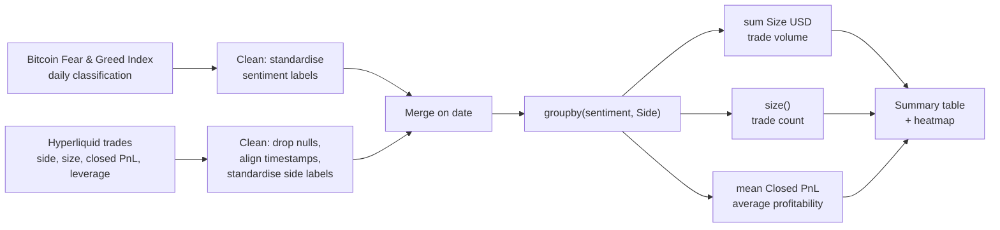

<h1 align="center">Trader Sentiment Analysis</h1>

<p align="center">
  Do traders actually make money being contrarian? Measuring realised PnL across<br>
  167,331 Hyperliquid trades, segmented by the Bitcoin Fear &amp; Greed Index.
</p>

<p align="center">
  
  
  
  
  
  
  
  <a href="https://github.com/VishnujanNarayanan/Trader_sentiment_analysis/actions/workflows/ci.yml"></a>
  <a href="https://trader-sentiment-demo.streamlit.app/"></a>
  <br>
  <a href="https://vishnujan-narayanan.vercel.app/"></a>
  <a href="https://github.com/VishnujanNarayanan"></a>
  <a href="https://www.linkedin.com/in/vishnujan-narayanan"></a>
  <a href="https://substack.com/@vishnujannarayanan"></a>
</p>

<p align="center">
  🎯 <a href="#why-this-project-exists">Why</a> ·
  🧩 <a href="#architecture">Architecture</a> ·
  📊 <a href="#key-insights">Results</a> ·
  ⚡ <a href="#installation">Installation</a> ·
  🖼️ <a href="#visuals">Figures</a> ·
  ⚠️ <a href="#limitations">Limitations</a>
</p>


---

## Live demo

**<https://trader-sentiment-demo.streamlit.app/>**

The contrarian edge per sentiment band, the Bitcoin Fear & Greed index pulled live from
the public API, and the caveats that matter — the per-trade ROC-AUC, the 32-account
concentration, and what fees do to the edge.

The 47MB trade export is not bundled with the deployment, so the page runs against a
precomputed summary of the full 167,331-trade result and says so in a banner. Every figure
on it is reproducible with `python -m trader_sentiment.build`. The app may take ~30 seconds
to wake if it has been idle.

---

## Why this project exists

"Be greedy when others are fearful" is repeated constantly and tested rarely. It is a claim about
returns, and returns are measurable — if you can line up a sentiment reading against the realised
PnL of actual trades on the days that reading applied.

This project does exactly that join. Daily Bitcoin Fear &amp; Greed classifications are merged
against Hyperliquid trade records on date, then average closed PnL is computed per
(sentiment, side) cell. The result is a direct answer to a specific question: on days the market
was fearful, did buyers or sellers earn more?

---

## Project Summary

This project analyzes trader behavior under varying market sentiment using the **Bitcoin Fear & Greed Index**. It explores how emotions—fear and greed—affect trading patterns, profitability, and volume.

By comparing trade statistics across sentiment levels, the analysis validates behavioral finance theory: **emotions drive trading performance**.

---

## Dataset Sources

- [📊 Historical Trade Data (Google Drive)](https://drive.google.com/file/d/1IAfLZwu6rJzyWKgBToqwSmmVYU6VbjVs/view?usp=sharing)  
- [🧭 Bitcoin Fear & Greed Index (Google Drive)](https://drive.google.com/file/d/1PgQC0tO8XN-wqkNyghWc_-mnrYv_nhSf/view?usp=sharing)

---

## Objective

This project explores the relationship between trader performance and Bitcoin market sentiment using two datasets:

- **Bitcoin Sentiment Data** – Daily Fear & Greed classifications  
- **Hyperliquid Trade Data** – Detailed trades including side, size, closed PnL, leverage, etc.

The goal is to discover patterns that support smarter, emotion-aware trading strategies in volatile crypto markets.

---

## Methodology

1. **Data Cleaning** – Removed nulls, aligned timestamps, standardized sentiment and side labels  
2. **Integration** – Merged sentiment and trade data by date  
3. **EDA** – Explored how trade counts, PnL, and volumes vary by sentiment  
4. **Visualization** – Created heatmaps and plots for clarity  
5. **Insight Derivation** – Quantified how fear and greed impact PnL  
6. **Strategy Framing** – Suggested a sentiment-based real-world trading strategy

---

## Key Insights

### The contrarian edge is real at the band level

Buy-minus-sell average profit, per sentiment band, over 167,331 trades:

| sentiment | buy PnL | sell PnL | buy − sell | favours |
|---|---|---|---|---|
| Extreme Fear | 55.67 | 24.20 | **+31.47** | BUY |
| Fear | 64.81 | 37.73 | **+27.08** | BUY |
| Neutral | 17.88 | 42.37 | −24.49 | SELL |
| Greed | 35.01 | 39.32 | −4.31 | SELL |
| Extreme Greed | 6.54 | 71.73 | **−65.18** | SELL |

Monotonic: strongly positive under fear, strongly negative under greed. Kruskal-Wallis
H = 685.66, p ≈ 4e-147, and **all ten pairwise comparisons survive a Bonferroni
correction**. Profit is nowhere near normally distributed, which is why the comparison is
rank-based rather than an ANOVA.


### …but it does not predict an individual trade

A difference in *average* profit is not the same claim as calling a *single* trade.
Tested directly, a classifier scores:

```
ROC-AUC   0.5310
base rate 0.8376
```

**0.53 is barely better than a coin flip.** Sentiment shifts the average; it does not call
the trade. That distinction is what separates a finding from a trading strategy, and it is
the reason the "Strategy Suggestion" below is framed as a description of the past.

<details>
<summary>The leak that first scored 0.94 on this task</summary>

The first attempt scored ROC-AUC 0.94, which is not a plausible number here. Roughly half
the export's rows are opens and adds, carrying `closed_pnl == 0` because no position was
closed. Labelling those "not profitable" turned the task into *"is this row a close?"* — a
question about the file format, which `Start Position` answers outright (it took 55% of the
feature importance, and `Start Position == 0` separated the classes perfectly).

Restricted to the 80,522 genuine closes, the honest score is 0.53. `closing_trades()` now
enforces the filter and two tests pin the leak so it cannot return.
</details>

### The edge survives fees

The original writeup listed "costs are excluded" as a limitation and stopped there. Measured:

| sentiment | avg PnL | avg fee | net of fee | fee as % of PnL |
|---|---|---|---|---|
| Neutral | 29.45 | 1.15 | 28.30 | 3.90% |
| Fear | 50.83 | 1.83 | 49.00 | 3.60% |
| Greed | 37.27 | 1.33 | 35.94 | 3.56% |
| Extreme Fear | 39.43 | 1.28 | 38.15 | 3.26% |
| Extreme Greed | 41.13 | 0.78 | 40.35 | 1.90% |

Fees eat 1.9–3.9% against a +31 edge. It survives.

### The effective sample is 32 traders, not 167,331 trades

This is the sharpest caveat in the project, and it was previously only prose:

```
accounts in the dataset:  32
top 1  account:  23.5% of all profit
top 5  accounts: 62.6%
top 10 accounts: 83.9%
```

**"Traders earn more buying into fear" is much closer to "these few traders did."** The
trade count is a big number attached to a small sample, and the honest reading of every
table above is conditioned on that.

---

## Strategy Suggestion

Buy during fear, sell during greed, stand aside when neutral.

Stated plainly: this is **a description of the past, not a validated rule**. It is derived
from the same data used to measure the effect, there is no out-of-sample test, and the
per-trade result above says the signal does not survive to the level of an individual
decision.

---

## Architecture


```mermaid
flowchart LR
    S["Bitcoin Fear &amp; Greed Index<br/>daily classification"] --> C1["Clean: standardise<br/>sentiment labels"]
    T["Hyperliquid trades<br/>side, size, closed PnL, leverage"] --> C2["Clean: drop nulls,<br/>align timestamps,<br/>standardise side labels"]

    C1 --> M["Merge on date"]
    C2 --> M

    M --> G["groupby(sentiment, Side)"]
    G --> A1["sum Size USD<br/>trade volume"]
    G --> A2["size()<br/>trade count"]
    G --> A3["mean Closed PnL<br/>average profitability"]

    A1 & A2 & A3 --> R["Summary table<br/>+ heatmap"]
```

The join is on **date**, so a trade inherits the sentiment classification of the day it was
placed. That is the assumption the whole analysis rests on — see [Limitations](#limitations).

---

## Project Structure

```
Trader_sentiment_analysis/
├── src/trader_sentiment/       # the tested logic
│   ├── config.py               #   paths from the environment
│   ├── fear_greed.py           #   the index, from its public API
│   ├── loaders.py              #   the trade export
│   ├── clean.py                #   join, coverage report, IQR filter
│   ├── analysis.py             #   summary tables and the contrarian edge
│   ├── stats.py                #   Shapiro -> Kruskal -> Dunn/Bonferroni
│   ├── model.py                #   the per-trade classifier
│   ├── db.py                   #   SQLite warehouse
│   └── build.py                #   python -m trader_sentiment.build
├── sql/                        # every question, as a file CI executes
├── tests/                      # 67 tests, no data or network required
├── app.py                      # the Streamlit page
├── traders_sentiment.ipynb     # the narrative, calling the modules
├── Dockerfile / docker-compose.yml
└── .github/workflows/ci.yml    # ruff, pytest (3.10 + 3.12), notebook, docker
```

---

## Installation

```bash
git clone https://github.com/VishnujanNarayanan/Trader_sentiment_analysis.git
cd Trader_sentiment_analysis

python -m venv env
source env/bin/activate          # Linux / macOS
env\Scripts\activate            # Windows

pip install -r requirements-dev.txt
```

The sentiment index downloads itself. Point at your copy of the trade export and build:

```bash
export TS_TRADES_CSV=/path/to/historical_data.csv
python -m trader_sentiment.build      # -> data/trader_sentiment.db
pytest                                # 67 tests, needs neither data nor network
jupyter notebook traders_sentiment.ipynb
```

The interactive page:

```bash
streamlit run app.py                  # http://localhost:8501
```

With Docker:

```bash
docker compose run --rm tests
docker compose up app                 # the page on :8501
```

---

## Visuals

All figures are generated by the notebook and written to `images/`.

| Figure | Shows |
|---|---|
| `pnl_vs_side_sentiment.png` | Average PnL by side within each sentiment band |
| `heatmap.png` | Average PnL across the full sentiment × side grid |
| `pnl_vs_sentiment.png` | Average PnL by sentiment, sides combined |

---

## Limitations

- **The effect is measured, not explained.** Higher average profit for buyers during fear
  is a correlation. Nothing here establishes that sentiment *caused* it.
- **32 accounts.** The single largest caveat — quantified above, and it conditions
  everything else.
- **Not a per-trade signal.** ROC-AUC 0.53. The band-level effect does not descend to the
  individual trade.
- **Sentiment is joined at daily resolution.** A trade placed during a mid-day reversal
  carries the whole day's classification.
- **Averages hide the distribution.** Means are reported without confidence intervals, so
  a handful of large wins can move a cell.
- **Position size is not controlled for.** Volume varies more than 4× across bands and
  per-trade average profit does not adjust for it.
- **Fees are accounted for; slippage and funding are not.**
- **One venue, one asset class.** Hyperliquid perpetuals only.
- **No out-of-sample check** of the strategy suggestion.

## Roadmap

- Report medians and confidence intervals alongside the means.
- Test the fear-buy / greed-sell differences for significance.
- Weight PnL by position size, and report PnL as a percentage of notional.
- Net out fees and funding.
- Split the window into train and holdout periods to check the effect out of sample.
- Compare against a buy-and-hold benchmark over the same period.

---

## Tech Stack

```text
Python · pandas · NumPy · scikit-learn · SciPy · scikit-posthocs
SQL (SQLite) · Streamlit · seaborn · Matplotlib · Jupyter
pytest · ruff · Docker · GitHub Actions
```

---

## License

Released under the MIT License — free to use, modify and distribute, with attribution and
without warranty.

> **Disclaimer:** This is a retrospective analysis of historical data, not financial advice and
> not a validated trading strategy.

---

## Author

<p align="center">
  <strong>Vishnujan Narayanan</strong>
</p>

<p align="center">
  <a href="https://vishnujan-narayanan.vercel.app/"></a>
  <a href="https://github.com/VishnujanNarayanan"></a>
  <a href="https://www.linkedin.com/in/vishnujan-narayanan"></a>
  <a href="https://substack.com/@vishnujannarayanan"></a>
</p>
